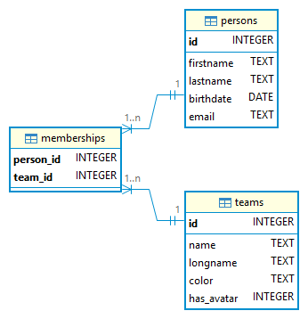
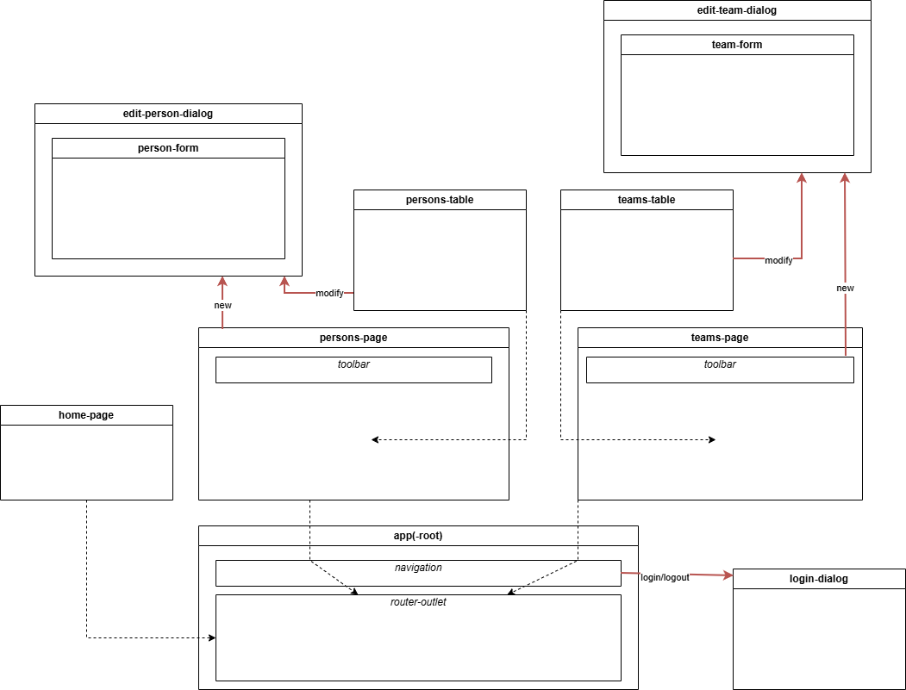

# Web Application Development
## version "continuous"

#### Install Angular (v20) tools
```bash
npm install -g @angular/cli@20
```
NOTE: from some reasons, it is not recommended to install Angular tools (as `ng`) locally (i.e. among the project files). Global installation (`-g` option) may require administrative rights to the system. On Mac and Linuxes, you should precede the command with `sudo`.

#### Consume this project

##### Clone sources to a local folder
```bash
git clone https://gitlab.com/mariusz.jarocki/wad-cont.git
```

##### Install dependecies for both frontend and backend
```bash
npm install && npm --prefix frontend install
```
##### Configure to your needs (changing default settings)
Copy `.env-example` to `.env` and customize the second file if needed.

##### Run both parts of Webapp using development servers
```bash
npm run dev
```
in the second terminal
```bash
cd frontend
npm run dev
```

##### To reinitialize databases
* stop the backend
* simply remove `./db/*.sqlite3` files (all or selected)
* start the backend

##### Enjoy the working Webapp in your browser!
http://localhost:4200

##### REST API documentation
[Click here](./API.md)

##### ERD diagram


##### Visual component dependencies
